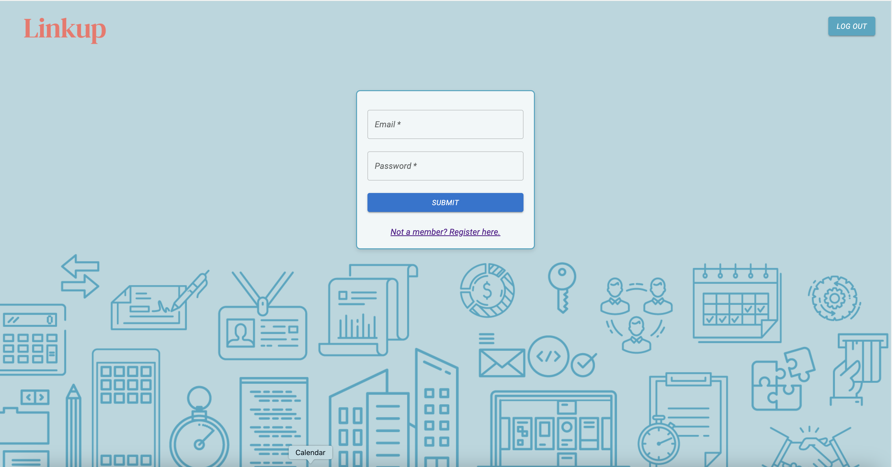

# LinkUp Final Project

## Table of Contents

- [Overview](#overview)
- [Features](#features)
- [Technologies](#technologies)
- [Installation](#installation)
- [Usage](#usage)
- [Environment Variables](#environment-variables)
- [Scripts](#scripts)
- [API Reference](#api-reference)
- [Error Handling](#error-handling)
- [Credits](#credits)
- [License](#license)
- [Contact](#contact)

---

## Overview
**LinkUp Final Project** is a full-stack web application built to facilitate user account management, event planning, and more. Users can register, log in, and engage with various functionalities based on their roles and permissions.

## Features
- User authentication and authorization using JSON Web Tokens (JWT)
- Event creation and management (Admin only)
- User profile management
- Real-time form validation and error handling
- Comprehensive error handling for server and client
- Toast notifications for enhanced user experience

## Technologies
This project leverages the following technologies:

- **Front-end**: React, Apollo Client, Vite, React Router, Material - **Back-end**: Node.js, Express.js, Apollo Server
- **Database**: MongoDB with Mongoose ORM
- **Authentication**: JWT for secure, token-based authentication

---

## Installation
Ensure you have the following installed:

- Node.js (v14 or later)
- MongoDB (locally or via a cloud provider like MongoDB Atlas)

### Setup

1. **Clone the repository**:
    ```bash
    git clone https://github.com/your-username/linkup-final.git
    cd linkup-final
    ```

2. **Install dependencies** for both server and client:
    ```bash
    # Install server dependencies
    cd server
    npm install

    # Install client dependencies
    cd ../client
    npm install
    ```

---

## Usage

Running the Application
Start the development server:
In the root directory, run

### Start the development server:
    --IN the root directory, run:
    `npm run dev`


## Visit the Application:
Open your browser and navigate to 
**<https://linkup-5oc1.onrender.com/>**

Register for an account as a regular user or use jen@email.com /password.

**Log in as an Admin using: test@email.com / password**

** User Authentication
Sign up as a new user or login if you already have an account.
Admin users can access additional controls for event creation and management.




### Environment Variables
Make sure to configure the following environment variables in your .env file:


**Variable     ||	**Description
PORT	     || The port number for the server
MONGODB_URI	 || MongoDB connection string
JWT_SECRET	 || Secret key for signing JWT tokens

## Scripts
The following scripts are available in this project:


### API Reference
The API supports the following endpoints and GraphQL queries/mutations:

### User Endpoints
**Sign Up**: Allows users to register with their details and get a JWT token.
Login: Authenticates a user and returns a JWT token for further requests.
Event Endpoints
Add Event: Allows admin users to add events, including details such as name, location, date, and time.
Update Event: Admins can modify existing events.
Delete Event: Admins can delete events.
Common Queries and Mutations

### User Queries
me: Returns details of the currently logged-in user.
users: Returns a list of all users (admin-only access).

### Event Queries
events: Retrieves a list of all events.
event(id: ID!): Retrieves the details of a specific event by ID.
User Mutations

### User Mutations
signup(userInput: UserInput): Registers a new user.
login(email: String!, password: String!): Logs in a user and returns a JWT token.


### Event Mutations
addEvent(input: EventInput!): Adds a new event (admin only).
updateEvent(id: ID!, input: EventInput!): Updates an existing event (admin only).
deleteEvent(id: ID!): Deletes an event (admin only).
Error Handling

The application uses ErrorPage for handling unexpected issues in the client and custom GraphQL error handling in the back-end, with detailed error logging in the console.

signup(userInput: UserInput): Registers a new user.
login(email: String!, password: String!): Logs in a user and returns a JWT token.
Event Mutations

addEvent(input: EventInput!): Adds a new event (admin only).
updateEvent(id: ID!, input: EventInput!): Updates an existing event (admin only).
deleteEvent(id: ID!): Deletes an event (admin only).


The application uses ErrorPage for handling unexpected issues in the client and custom GraphQL error handling in the back-end, with detailed error logging in the console.

In the auth.js file, unauthorized access is managed by AuthenticationError using custom JWT validation. Any invalid tokens result in an appropriate error message.

## Error Handling

The application uses ErrorPage for handling unexpected issues in the client and custom GraphQL error handling in the back-end, with detailed error logging in the console.

In the auth.js file, unauthorized access is managed by AuthenticationError using custom JWT validation. Any invalid tokens result in an appropriate error message.

## License

This project is licensed under the MIT License. See the LICENSE file for more details.

## Credits
## Credits

\*\* This project was accomplished with the help provided by the instructors and TAs of the Rice University Coding Bootcamp, including Instructor Darian Mendez, Mateo Wallace, Mark Alfano, Gerard Mennella

## Contact

For further questions or suggestions:

**Email**: rachel@pixelstreetmedia.com
**GitHub**: github.com/rachelb36
